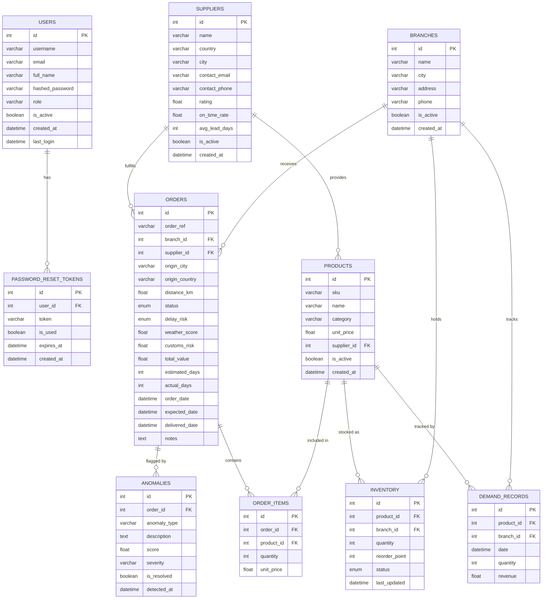
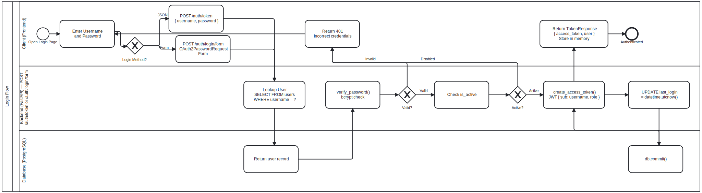
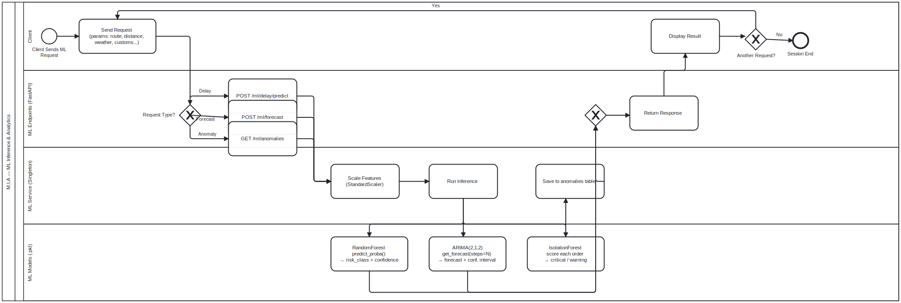
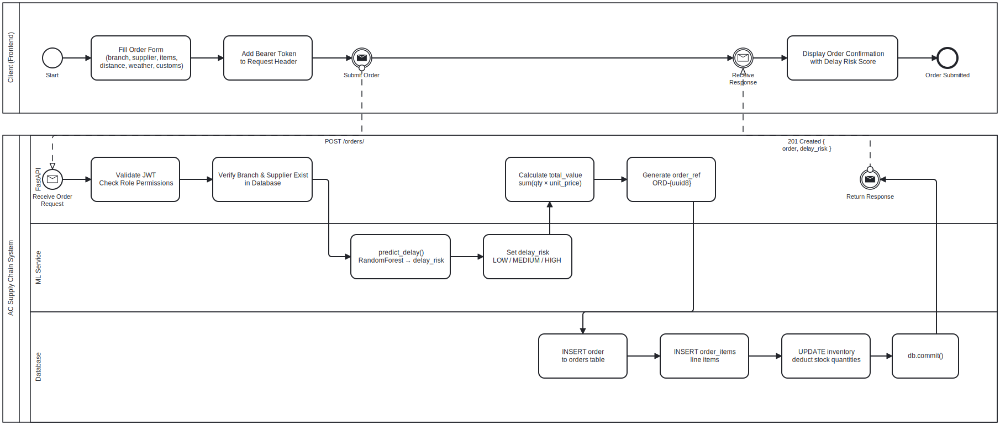
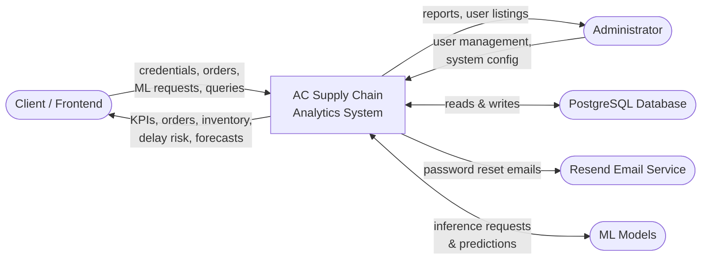
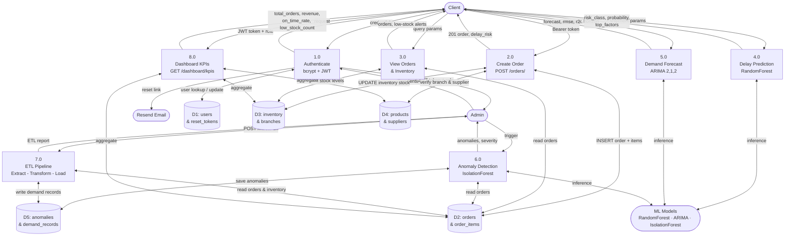

# ERD — Database Schema

```mermaid
erDiagram
    USERS {
        int id PK
        varchar username
        varchar email
        varchar full_name
        varchar hashed_password
        varchar role
        boolean is_active
        datetime created_at
        datetime last_login
    }
    PASSWORD_RESET_TOKENS {
        int id PK
        int user_id FK
        varchar token
        boolean is_used
        datetime expires_at
        datetime created_at
    }
    BRANCHES {
        int id PK
        varchar name
        varchar city
        varchar address
        varchar phone
        boolean is_active
        datetime created_at
    }
    SUPPLIERS {
        int id PK
        varchar name
        varchar country
        varchar city
        varchar contact_email
        varchar contact_phone
        float rating
        float on_time_rate
        int avg_lead_days
        boolean is_active
        datetime created_at
    }
    PRODUCTS {
        int id PK
        varchar sku
        varchar name
        varchar category
        float unit_price
        int supplier_id FK
        boolean is_active
        datetime created_at
    }
    ORDERS {
        int id PK
        varchar order_ref
        int branch_id FK
        int supplier_id FK
        varchar origin_city
        varchar origin_country
        float distance_km
        enum status
        enum delay_risk
        float weather_score
        float customs_risk
        float total_value
        int estimated_days
        int actual_days
        datetime order_date
        datetime expected_date
        datetime delivered_date
        text notes
    }
    ORDER_ITEMS {
        int id PK
        int order_id FK
        int product_id FK
        int quantity
        float unit_price
    }
    INVENTORY {
        int id PK
        int product_id FK
        int branch_id FK
        int quantity
        int reorder_point
        enum status
        datetime last_updated
    }
    ANOMALIES {
        int id PK
        int order_id FK
        varchar anomaly_type
        text description
        float score
        varchar severity
        boolean is_resolved
        datetime detected_at
    }
    DEMAND_RECORDS {
        int id PK
        int product_id FK
        int branch_id FK
        datetime date
        int quantity
        float revenue
    }

    USERS ||--o{ PASSWORD_RESET_TOKENS : "has"
    BRANCHES ||--o{ ORDERS : "receives"
    BRANCHES ||--o{ INVENTORY : "holds"
    BRANCHES ||--o{ DEMAND_RECORDS : "tracks"
    SUPPLIERS ||--o{ ORDERS : "fulfills"
    SUPPLIERS ||--o{ PRODUCTS : "provides"
    PRODUCTS ||--o{ ORDER_ITEMS : "included in"
    PRODUCTS ||--o{ INVENTORY : "stocked as"
    PRODUCTS ||--o{ DEMAND_RECORDS : "tracked by"
    ORDERS ||--o{ ORDER_ITEMS : "contains"
    ORDERS ||--o{ ANOMALIES : "flagged by"
```

# Login Flow

# M.I.A Chat Flow

# Assignment Submission Flow

# DFD Level 0 — Context Diagram

```mermaid
flowchart LR
    CLIENT([Client / Frontend])
    ADMIN([Administrator])
    POSTGRES([PostgreSQL Database])
    EMAIL([Resend Email Service])
    ML([ML Models])

    CLIENT -->|credentials, orders,\nML requests, queries| SYS[AC Supply Chain\nAnalytics System]
    ADMIN -->|user management,\nsystem config| SYS

    SYS -->|KPIs, orders, inventory,\ndelay risk, forecasts| CLIENT
    SYS -->|reports, user listings| ADMIN

    SYS <-->|reads & writes| POSTGRES
    SYS -->|password reset emails| EMAIL
    SYS <-->|inference requests\n& predictions| ML
```

# DFD Level 1 — Process Detail

```mermaid
flowchart TD
    CLIENT([Client])
    ADMIN([Admin])
    EMAIL([Resend Email])
    ML([ML Models\nRandomForest · ARIMA · IsolationForest])

    D1[(D1: users\n& reset_tokens)]
    D2[(D2: orders\n& order_items)]
    D3[(D3: inventory\n& branches)]
    D4[(D4: products\n& suppliers)]
    D5[(D5: anomalies\n& demand_records)]

    CLIENT & ADMIN -->|credentials| P1[1.0\nAuthenticate\nbcrypt + JWT]
    P1 <-->|user lookup / update| D1
    P1 -->|JWT token + role| CLIENT & ADMIN
    P1 -->|reset link| EMAIL

    CLIENT -->|order data,\nBearer token| P2[2.0\nCreate Order\nPOST /orders/]
    P2 <-->|verify branch & supplier| D4
    P2 <-->|INSERT order + items| D2
    P2 <-->|UPDATE inventory stock| D3
    P2 -->|201 order, delay_risk| CLIENT

    CLIENT -->|query params| P3[3.0\nView Orders\n& Inventory]
    P3 <-->|read orders| D2
    P3 <-->|read stock levels| D3
    P3 -->|orders, low-stock alerts| CLIENT

    CLIENT -->|shipment params| P4[4.0\nDelay Prediction\nRandomForest]
    CLIENT -->|category, horizon| P5[5.0\nDemand Forecast\nARIMA 2,1,2]
    ADMIN -->|trigger| P6[6.0\nAnomaly Detection\nIsolationForest]

    P4 <-->|inference| ML
    P5 <-->|inference| ML
    P6 <-->|inference| ML

    P4 -->|risk_class, probability,\ntop_factors| CLIENT
    P5 -->|forecast, rmse, r2| CLIENT
    P6 <-->|read orders| D2
    P6 <-->|save anomalies| D5
    P6 -->|anomalies, severity| ADMIN

    ADMIN -->|POST /ml/etl/run| P7[7.0\nETL Pipeline\nExtract - Transform - Load]
    P7 <-->|read orders & inventory| D2
    P7 <-->|write demand records| D5
    P7 -->|ETL report| ADMIN

    CLIENT -->|request| P8[8.0\nDashboard KPIs\nGET /dashboard/kpis]
    P8 <-->|aggregate| D2
    P8 <-->|aggregate| D3
    P8 <-->|aggregate| D4
    P8 -->|total_orders, revenue,\non_time_rate, low_stock_count| CLIENT
```
